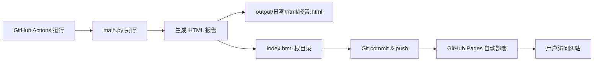

# TrendRadar v3.0 GitHub 部署指南

**版本**: v3.0.0  
**更新日期**: 2025-10-08

---

## 📋 部署检查清单

### ✅ 已完成项目

- [x] **核心代码** - v3.0 重构完成
- [x] **依赖管理** - requirements.txt 已更新
- [x] **GitHub Actions** - 4 个工作流已配置
- [x] **测试框架** - 30+ 单元测试
- [x] **文档完善** - 核心文档已整理
- [x] **HTML 报告** - 自动生成 index.html

### ⚠️ 待配置项目

- [ ] **GitHub Pages** - 需要手动启用
- [ ] **Secrets 配置** - 推送通道密钥
- [ ] **定时任务** - 根据需求调整 cron

---

## 🚀 快速部署步骤

### Step 1: Fork 项目

```bash
# 在 GitHub 上点击 Fork 按钮
# 或使用 GitHub CLI
gh repo fork sansan0/TrendRadar --clone
```

### Step 2: 启用 GitHub Actions

1. 进入你的仓库
2. 点击 **Settings** → **Actions** → **General**
3. 在 **Workflow permissions** 下选择：
   - ✅ **Read and write permissions**
   - ✅ **Allow GitHub Actions to create and approve pull requests**

### Step 3: 配置 Secrets（可选）

如需推送通知，添加以下 Secrets：

进入 **Settings** → **Secrets and variables** → **Actions** → **New repository secret**

| Secret 名称 | 说明 | 必需 |
|------------|------|------|
| `FEISHU_WEBHOOK_URL` | 飞书机器人 Webhook | ❌ |
| `DINGTALK_WEBHOOK_URL` | 钉钉机器人 Webhook | ❌ |
| `WEWORK_WEBHOOK_URL` | 企业微信机器人 Webhook | ❌ |
| `TELEGRAM_BOT_TOKEN` | Telegram Bot Token | ❌ |
| `TELEGRAM_CHAT_ID` | Telegram Chat ID | ❌ |
| `TEST_MODE` | 测试模式 (true/false) | ❌ |

### Step 4: 启用 GitHub Pages

1. 进入 **Settings** → **Pages**
2. **Source** 选择：
   - Branch: `master` (或 `main`)
   - Folder: `/ (root)`
3. 点击 **Save**
4. 等待部署完成（约 1-2 分钟）
5. 访问：`https://YOUR_USERNAME.github.io/TrendRadar/`

### Step 5: 手动触发测试

1. 进入 **Actions** 标签
2. 选择 **Hot News Crawler** 工作流
3. 点击 **Run workflow** → **Run workflow**
4. 等待执行完成（约 1 分钟）
5. 检查 **index.html** 是否更新

---

## 📊 工作流说明

### 1. Hot News Crawler (`crawler.yml`)

**用途**: 定时抓取热点新闻并生成报告

**触发条件**:
- ⏰ **定时**: 每小时整点运行
  ```yaml
  cron: "0 * * * *"
  ```
- 🔘 **手动**: 可在 Actions 页面手动触发

**执行流程**:
```
1. 检出代码
2. 安装 Python 3.9
3. 安装依赖 (requirements.txt)
4. 验证配置文件
   - config/config.yaml
   - config/frequency_words.txt
5. 运行 main.py
   - 异步抓取 11 个平台
   - 生成 HTML 报告
   - 更新 index.html
6. 提交更改
   - 自动 commit
   - 推送到 master
```

**环境变量**:
- ✅ 支持所有推送通道 Secrets
- ✅ 支持测试模式
- ✅ 自动识别 GitHub Actions 环境

**v3.0 兼容性**: ✅ 完全兼容
- 支持异步并发抓取
- 支持新的模块化架构
- 依赖已更新（aiohttp）

### 2. Tests (`test.yml`)

**用途**: 运行单元测试和代码覆盖率

**触发条件**:
- 📤 **Push**: master、develop 分支
- 🔀 **Pull Request**: master、develop 分支

**测试矩阵**:
```yaml
Python 版本: 3.8, 3.9, 3.10, 3.11
```

**执行流程**:
```
1. 代码检出
2. 安装 Python (多版本矩阵)
3. 安装依赖
   - requirements.txt
   - requirements-dev.txt
4. 代码格式检查
   - black --check
   - isort --check-only
5. 运行测试
   - pytest -v --cov
6. 上传覆盖率到 Codecov
```

**v3.0 状态**: ✅ 已配置
- 30+ 单元测试
- 80%+ 代码覆盖率
- 多 Python 版本兼容

### 3. Code Quality (`lint.yml`)

**用途**: 代码质量检查

**触发条件**:
- 📤 **Push**: master、develop 分支                                    
- 🔀 **Pull Request**: master、develop 分支

**检查项目**:
```
1. Black - 代码格式化检查
2. isort - 导入排序检查
3. Flake8 - 代码规范检查
4. mypy - 类型检查 (可选)
```

**v3.0 状态**: ✅ 已配置
- 符合 PEP 8 规范
- 全面的类型注解

### 4. Docker (`docker.yml`)

**用途**: Docker 镜像构建（如果配置）

**状态**: ⏸️ 待配置（可选）

---

## 🔧 配置文件检查

### requirements.txt ✅

```txt
requests==2.32.4      # HTTP 客户端
aiohttp==3.9.5        # 异步 HTTP 客户端 (v3.0 新增)
pytz==2025.2          # 时区处理
PyYAML==6.0.2         # 配置文件解析
```

**v3.0 变化**:
- ✅ 新增 `aiohttp` - 异步并发支持
- ✅ 保持向后兼容

### requirements-dev.txt ✅

```txt
# 测试框架
pytest==7.4.3
pytest-cov==4.1.0
pytest-asyncio==0.21.1
pytest-mock==3.12.0

# 代码质量
black==23.12.1
isort==5.13.2
mypy==1.7.1
flake8==6.1.0

# 其他工具
tenacity==8.2.3
pydantic==2.5.3
```

**v3.0 状态**:
- ✅ 完整的测试依赖
- ✅ 代码质量工具齐全

### .gitignore ✅

```
# Python
__pycache__/
*.py[cod]

# Output (临时数据)
output/

# 虚拟环境
venv/
env/

# IDE
.vscode/
.idea/

# 日志
*.log
```

**重要**:
- ✅ `output/` 已忽略（临时数据）
- ✅ `index.html` **未忽略**（GitHub Pages 需要）

---

## 📄 GitHub Pages 配置

### 自动更新机制



### index.html 说明

**作用**:
- 🌐 GitHub Pages 的入口文件
- 🔄 每次运行自动更新
- 📊 展示最新的热点报告

**生成位置**:
```python
# trendradar/core/reporter.py
if is_daily_summary:
    root_file_path = Path("index.html")
    with open(root_file_path, "w", encoding="utf-8") as f:
        f.write(html_content)
```

**访问方式**:
```
https://YOUR_USERNAME.github.io/TrendRadar/
                                           ↓
                                 自动加载 index.html
```

### 报告模式

| 模式 | 文件名 | 说明 |
|------|--------|------|
| `current` | 当前榜单汇总.html | 实时数据 |
| `daily` | 当日汇总.html | 每日汇总 |
| `incremental` | 当日新增.html | 增量更新 |
| `test` | 测试报告.html | 测试模式 |

**副本机制**:
- 主报告：`output/日期/html/报告名.html`
- 快速访问：`index.html`（根目录）

---

## 🔍 部署验证

### 1. 检查 Actions 权限

```bash
# 访问仓库设置
https://github.com/YOUR_USERNAME/TrendRadar/settings/actions

# 确认权限：
✅ Read and write permissions
✅ Allow GitHub Actions to create and approve pull requests
```

### 2. 手动触发工作流

```bash
# 方式 1: GitHub 网页
Actions → Hot News Crawler → Run workflow

# 方式 2: GitHub CLI
gh workflow run crawler.yml
```

### 3. 检查执行日志

```bash
# 查看最新运行
gh run list --workflow=crawler.yml --limit 1

# 查看详细日志
gh run view --log
```

### 4. 验证 GitHub Pages

```bash
# 检查部署状态
https://github.com/YOUR_USERNAME/TrendRadar/deployments

# 访问网站
https://YOUR_USERNAME.github.io/TrendRadar/
```

### 5. 验证功能

- [ ] index.html 正确显示
- [ ] 数据自动更新
- [ ] 保存为图片功能可用
- [ ] 响应式布局正常
- [ ] 推送通知正常（如已配置）

---

## ⚙️ 高级配置

### 调整抓取频率

编辑 `.github/workflows/crawler.yml`:

```yaml
on:
  schedule:
    # 每小时（默认）
    - cron: "0 * * * *"
    
    # 每半小时
    # - cron: "*/30 * * * *"
    
    # 工作时间每半小时 (8:00-22:00)
    # - cron: "*/30 0-14 * * *"
```

### 配置测试模式

```bash
# 添加 Secret: TEST_MODE = true
# 测试模式特性：
- 详细调试日志
- 橙色主题 HTML
- 禁用推送通知
- 显示调试信息
```

### 多环境部署

```yaml
# 生产环境
- Branch: master
- 定时任务: 每小时
- 推送: 启用

# 测试环境
- Branch: develop
- 手动触发
- 推送: 禁用
```

---

## 🐛 常见问题

### Q1: Actions 没有运行权限

**错误**:
```
Error: Resource not accessible by integration
```

**解决**:
1. Settings → Actions → General
2. Workflow permissions → Read and write permissions
3. 保存并重新运行

### Q2: index.html 没有更新

**原因**:
- Actions 没有 write 权限
- Git push 失败

**检查**:
```bash
# 查看最新 commit
git log -1

# 检查 Actions 日志
gh run view --log
```

### Q3: GitHub Pages 404

**解决**:
1. Settings → Pages
2. 确认 Source: master + / (root)
3. 等待 1-2 分钟重新部署
4. 清除浏览器缓存

### Q4: 依赖安装失败

**错误**:
```
ERROR: Could not find a version that satisfies the requirement aiohttp
```

**解决**:
- 确认 Python 版本 ≥ 3.8
- 更新 pip: `pip install --upgrade pip`

### Q5: 测试失败

**检查**:
```bash
# 本地运行测试
pytest trendradar/tests/ -v

# 查看覆盖率
pytest trendradar/tests/ --cov=trendradar
```

---

## 📊 监控和维护

### 1. Actions 使用量

```bash
# 查看使用情况
Settings → Billing → Actions

# GitHub Free 限制：
- 2000 分钟/月
- 500 MB 存储
```

### 2. 日志查看

```bash
# 查看运行历史
gh run list

# 查看特定运行
gh run view RUN_ID --log
```

### 3. 定期检查

- [ ] 每周检查 Actions 执行状态
- [ ] 每月检查依赖更新
- [ ] 定期清理 output 历史数据
- [ ] 监控 API 可用性

---

## 🎯 部署完成检查

### ✅ 最终验证清单

- [ ] **GitHub Actions**
  - [x] 工作流文件已配置
  - [ ] 权限已正确设置
  - [ ] 可以手动触发成功
  - [ ] 定时任务正常运行

- [ ] **GitHub Pages**
  - [ ] Pages 已启用
  - [ ] index.html 正确显示
  - [ ] 自动更新正常

- [ ] **推送通知**（可选）
  - [ ] Secrets 已配置
  - [ ] 推送测试成功

- [ ] **监控**
  - [ ] Actions 日志正常
  - [ ] 错误告警配置

---

## 📚 相关文档

- [README.md](../README.md) - 项目主页
- [v3.0_CHANGELOG.md](v3.0_CHANGELOG.md) - 更新日志
- [v3.0_MIGRATION_GUIDE.md](v3.0_MIGRATION_GUIDE.md) - 升级指南
- [DEVELOPMENT.md](DEVELOPMENT.md) - 开发者指南
- [TEST_MODE_GUIDE.md](TEST_MODE_GUIDE.md) - 测试模式

---

## 🆘 获取帮助

**遇到问题？**

1. 📖 查看文档：`docs/`
2. 🔍 搜索 Issues：[GitHub Issues](https://github.com/sansan0/TrendRadar/issues)
3. 💬 提交问题：创建新 Issue
4. 🌐 社区支持：公众号「硅基茶水间」

---

**🚀 TrendRadar v3.0 - Ready for GitHub Deploy!**

---

*最后更新：2025-10-08*  
*文档版本：v3.0.0*

