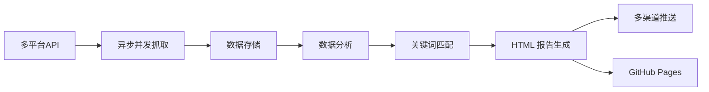

<div align="center">

# 🎯TrendRadar

🚀 最快<strong>30秒</strong>部署的热点助手 —— 告别无效刷屏，只看真正关心的新闻资讯

[](https://github.com/sansan0/TrendRadar/stargazers)
[](https://github.com/sansan0/TrendRadar/network/members)
[](LICENSE)
[](https://github.com/sansan0/TrendRadar)

[](https://work.weixin.qq.com/)
[](https://telegram.org/)
[](#)
[](https://www.feishu.cn/)
[](https://github.com/sansan0/TrendRadar)
[](https://sansan0.github.io/TrendRadar)
[](https://hub.docker.com/)

</div>

## 📖 目录

- [项目简介](#-项目简介)
- [核心功能](#-核心功能)
- [快速开始](#-快速开始)
- [配置指南](#-配置指南)
- [部署方式](#-部署方式)
- [更新日志](#-更新日志)
- [开发者指南](#-开发者指南)
- [常见问题](#-常见问题)
- [学习交流](#-学习交流)
- [许可证](#-许可证)

---

## 📌 项目简介

> 本项目以轻量，易部署为目标
>
> 遇到问题提 issues

**TrendRadar** 是一个智能化的全网热点聚合与推送系统，帮助你从海量信息中筛选出真正关心的内容。

### 🎯 核心理念

- **轻量化**：极简依赖，30秒快速部署
- **模块化**：清晰的代码结构，易于维护和扩展
- **高性能**：异步并发抓取，30倍速度提升
- **用户自主**：自定义关键词，不被算法推荐绑架
- **算法透明**：权重配置完全开放，用户可自由调整

### 🆕 v3.0 重大更新

- ⚡️ **性能飞跃**：异步并发抓取，11 个平台从 60 秒降至 2 秒（**30倍提升**）
- 📦 **架构重构**：代码精简 88.7%，从单文件 3897 行到模块化 456 行
- 🎨 **现代化 UI**：全新 HTML 报告设计，渐变色主题，响应式布局
- 🧪 **完善测试**：30+ 单元测试，80%+ 代码覆盖率
- 📝 **标准日志**：Python logging 模块，文件 + 控制台双输出
- ✅ **配置验证**：启动时自动检查配置，友好的错误提示

📖 详细更新日志：[v3.0_CHANGELOG.md](docs/v3.0_CHANGELOG.md)

### ✨ 适用场景

| 用户群体 | 推荐模式 | 典型场景 |
|---------|---------|---------|
| 📈 投资者/交易员 | `incremental` | 及时获取新增资讯，快速决策 |
| 📰 自媒体人/内容创作者 | `current` | 掌握实时热点趋势，创作选题 |
| 📋 企业管理者/普通用户 | `daily` | 定时获取完整日报，全面了解 |

---

## ✨ 核心功能

### 1. 全网热点聚合

默认监控 **11 个主流平台**：

- 今日头条、百度热搜、华尔街见闻
- 澎湃新闻、bilibili 热搜、财联社热门
- 凤凰网、贴吧、微博、抖音、知乎

如想额外增加，可看 [自定义监控平台](#自定义监控平台)

### 2. 智能推送策略

**三种推送模式**：

| 模式 | 推送时机 | 显示内容 | 适用场景 |
|------|----------|----------|----------|
| **当日汇总模式**<br/>`daily` | 按时推送 | 当日所有匹配新闻<br/>+ 新增新闻区域 | 日报总结<br/>全面了解当日热点趋势 |
| **当前榜单模式**<br/>`current` | 按时推送 | 当前榜单匹配新闻<br/>+ 新增新闻区域 | 实时热点追踪<br/>了解当前最火的内容 |
| **增量监控模式**<br/>`incremental` | 有新增才推送 | 新出现的匹配频率词新闻 | 避免重复信息干扰<br/>高频监控场景 |

**静默推送模式**：

- **时间范围控制**：设定推送时间窗口（如 9:00-18:00），仅在指定时间内推送
- **适用场景**：
  - 时间内每次执行都推送
  - 时间范围内只推送一次

### 3. 精准内容筛选

设置个人关键词（如：AI、比亚迪、教育政策），只推送相关热点，过滤无关信息

- 支持普通词、必须词(+)、过滤词(!)三种语法，具体见 [frequency_words.txt 配置教程](#frequency_wordstxt-配置教程)
- 词组化管理，独立统计不同主题热点

> 也可以不做筛选，完整的推送所有热点，具体见【历史更新】中的 v2.0.1

### 4. 个性化热点算法

不再被各个平台的算法牵着走，TrendRadar 会重新整理全网热搜：

- **看重排名高的新闻**（占60%）：各平台前几名的新闻优先显示
- **关注持续出现的话题**（占30%）：反复出现的新闻更重要  
- **考虑排名质量**（占10%）：不仅多次出现，还经常排在前列

**实际效果**：把分散在各个平台的热搜合并起来，按照你关心的热度重新排序

> 这三个比例可以选择适合自己的场景进行调整，具体见 [热点权重调整](#热点权重调整)

### 5. 多渠道实时推送

支持**企业微信**、**飞书**、**钉钉**、**Telegram**，消息直达手机

### 6. 多端适配

- **GitHub Pages**：自动生成精美网页报告，PC/移动端适配
- **Docker部署**：支持多架构容器化运行
- **数据持久化**：HTML/TXT多格式历史记录保存

### 7. 减少 APP 依赖

从"被算法推荐绑架"变成"主动获取自己想要的信息"

| Github Pages 网页效果(手机端也适配) | 飞书推送效果 |
|:---:|:---:|
|  |  |

<details>
<summary><strong>👉 推送格式说明</strong></summary>

## **通知示例：**

📊 热点词汇统计

🔥 [1/3] AI ChatGPT : 2 条

  1. [百度热搜] 🆕 ChatGPT-5正式发布 [**1**] - 09时15分 (1次)
  
  2. [今日头条] AI芯片概念股暴涨 [**3**] - [08时30分 ~ 10时45分] (3次)
  
━━━━━━━━━━━━━━━━━━━

📈 [2/3] 比亚迪 特斯拉 : 2 条

  1. [微博] 🆕 比亚迪月销量破纪录 [**2**] - 10时20分 (1次)
  
  2. [抖音] 特斯拉降价促销 [**4**] - [07时45分 ~ 09时15分] (2次)

━━━━━━━━━━━━━━━━━━━

📌 [3/3] A股 股市 : 1 条

  1. [华尔街见闻] A股午盘点评分析 [**5**] - [11时30分 ~ 12时00分] (2次)

🆕 本次新增热点新闻 (共 2 条)

**百度热搜** (1 条):
  1. ChatGPT-5正式发布 [**1**]

**微博** (1 条):
  1. 比亚迪月销量破纪录 [**2**]

更新时间：2025-01-15 12:30:15

## **消息格式说明**

| 格式元素      | 示例                        | 含义         | 说明                                    |
| ------------- | --------------------------- | ------------ | --------------------------------------- |
| 🔥📈📌        | 🔥 [1/3] AI ChatGPT        | 热度等级     | 🔥高热度(≥10条) 📈中热度(5-9条) 📌普通热度(<5条) |
| [序号/总数]   | [1/3]                       | 排序位置     | 当前词组在所有匹配词组中的排名          |
| 频率词组      | AI ChatGPT                  | 关键词组     | 配置文件中的词组，标题必须包含其中词汇   |
| : N 条        | : 2 条                      | 匹配数量     | 该词组匹配的新闻总数                    |
| [平台名]      | [百度热搜]                  | 来源平台     | 新闻所属的平台名称                      |
| 🆕            | 🆕 ChatGPT-5正式发布        | 新增标记     | 本轮抓取中首次出现的热点                |
| [**数字**]    | [**1**]                     | 高排名       | 排名≤阈值的热搜，红色加粗显示           |
| [数字]        | [7]                         | 普通排名     | 排名>阈值的热搜，普通显示               |
| - 时间        | - 09时15分                  | 首次时间     | 该新闻首次被发现的时间                  |
| [时间~时间]   | [08时30分 ~ 10时45分]       | 持续时间     | 从首次出现到最后出现的时间范围          |
| (N次)         | (3次)                       | 出现频率     | 在监控期间出现的总次数                  |
| **新增区域**  | 🆕 **本次新增热点新闻**      | 新话题汇总   | 单独展示本轮新出现的热点话题            |

</details>

---

## 🚀 快速开始

### 步骤 1：Fork 本项目

点击本页面右上角的 "Fork" 按钮，将项目 Fork 到你的 GitHub 账户

### 步骤 2：配置推送渠道（可选）

在你 Fork 后的仓库中，进入 `Settings` > `Secrets and variables` > `Actions` > `New repository secret`

可以同时配置多个平台，系统会向所有配置的平台发送通知。

<details>
<summary> <strong>👉 企业微信机器人</strong>（配置最简单最迅速）</summary>
<br>

**GitHub Secret 配置：**
- 名称：`WEWORK_WEBHOOK_URL`
- 值：你的企业微信机器人 Webhook 地址

**机器人设置步骤：**

#### 手机端设置：
1. 打开企业微信 App → 进入目标内部群聊
2. 点击右上角"…"按钮 → 选择"群机器人"
3. 点击"添加" → 点击"新建" → 设置机器人昵称
4. 复制 Webhook 地址，配置到上方的 GitHub Secret 中

#### PC 端设置流程类似
</details>

<details>
<summary> <strong>👉 飞书机器人</strong>（消息显示最友好）</summary>
<br>

**GitHub Secret 配置：**
- 名称：`FEISHU_WEBHOOK_URL`
- 值：你的飞书机器人 Webhook 地址

**机器人设置步骤：**

1. 电脑浏览器打开 https://botbuilder.feishu.cn/home/my-app

2. 点击"新建机器人应用"

3. 进入创建的应用后，点击"流程涉及" > "创建流程" > "选择触发器"

4. 往下滑动，点击"Webhook 触发"

5. 此时你会看到"Webhook 地址"，把这个链接先复制到本地记事本暂存，继续接下来的操作

6. "参数"里面放上下面的内容，然后点击"完成"

```json
{
  "message_type": "text",
  "content": {
    "total_titles": "{{内容}}",
    "timestamp": "{{内容}}",
    "report_type": "{{内容}}",
    "text": "{{内容}}"
  }
}
```

7. 点击"选择操作" > "发送飞书消息"，勾选 "群消息"，然后点击下面的输入框，点击"我管理的群组"（如果没有群组，你可以在飞书 app 上创建群组）

8. 消息标题填写"TrendRadar 热点监控"

9. 最关键的部分来了，点击 + 按钮，选择"Webhook 触发"，然后按照下面的图片摆放


10. 配置完成后，将第 5 步复制的 Webhook 地址配置到 GitHub Secrets 中的 `FEISHU_WEBHOOK_URL`
</details>

<details>
<summary> <strong>👉 钉钉机器人</strong></summary>
<br>

**GitHub Secret 配置：**
- 名称：`DINGTALK_WEBHOOK_URL`
- 值：你的钉钉机器人 Webhook 地址

**机器人设置步骤：**

1. **创建机器人（仅 PC 端支持）**：
   - 打开钉钉 PC 客户端，进入目标群聊
   - 点击群设置图标（⚙️）→ 往下翻找到"机器人"点开
   - 选择"添加机器人" → "自定义"

2. **配置机器人**：
   - 设置机器人名称
   - **安全设置**：
     - **自定义关键词**：设置 "热点"

3. **完成设置**：
   - 勾选服务条款协议 → 点击"完成"
   - 复制获得的 Webhook URL
   - 将 URL 配置到 GitHub Secrets 中的 `DINGTALK_WEBHOOK_URL`

**注意**：移动端只能接收消息，无法创建新机器人。
</details>

<details>
<summary> <strong>👉 Telegram Bot</strong></summary>
<br>

**GitHub Secret 配置：**
- 名称：`TELEGRAM_BOT_TOKEN` - 你的 Telegram Bot Token
- 名称：`TELEGRAM_CHAT_ID` - 你的 Telegram Chat ID

**机器人设置步骤：**

1. **创建机器人**：
   - 在 Telegram 中搜索 `@BotFather`（大小写注意，有蓝色徽章勾勾，有类似 37849827 monthly users，这个才是官方的，有一些仿官方的账号注意辨别）
   - 发送 `/newbot` 命令创建新机器人
   - 设置机器人名称（必须以"bot"结尾，很容易遇到重复名字，所以你要绞尽脑汁想不同的名字）
   - 获取 Bot Token（格式如：`123456789:AAHfiqksKZ8WmR2zSjiQ7_v4TMAKdiHm9T0`）

2. **获取 Chat ID**：

   **方法一：通过官方 API 获取**
   - 先向你的机器人发送一条消息
   - 访问：`https://api.telegram.org/bot<你的Bot Token>/getUpdates`
   - 在返回的 JSON 中找到 `"chat":{"id":数字}` 中的数字

   **方法二：使用第三方工具**
   - 搜索 `@userinfobot` 并发送 `/start`
   - 获取你的用户 ID 作为 Chat ID

3. **配置到 GitHub**：
   - `TELEGRAM_BOT_TOKEN`：填入第 1 步获得的 Bot Token
   - `TELEGRAM_CHAT_ID`：填入第 2 步获得的 Chat ID
</details>

### 步骤 3：配置关键词

编辑 [config/frequency_words.txt](config/frequency_words.txt) 文件，添加你关心的关键词

详细配置说明见 [frequency_words.txt 配置教程](#frequency_wordstxt-配置教程)

### 步骤 4：配置运行模式（可选）

在 [config/config.yaml](config/config.yaml) 中修改 `report.mode` 设置：

- `daily`：当日汇总模式
- `current`：当前榜单模式（默认）
- `incremental`：增量监控模式

### 步骤 5：开启 GitHub Pages（可选）

想要网页版？进入你的仓库 Settings → Pages，启用 GitHub Pages。[效果预览](https://sansan0.github.io/TrendRadar/)

💡 **提示：** GitHub Pages 支持一键保存成图片，随时分享给他人

---

## 📝 配置指南

### config.yaml 配置说明

主配置文件位于 `config/config.yaml`，包含以下主要配置项：

```yaml
# 应用配置
app:
  version_check_url: "..."
  show_version_update: true  # 是否显示版本更新提示
  test_mode: false          # 测试模式，用于调试

# 爬虫配置
crawler:
  request_interval: 1000    # 请求间隔(毫秒)
  enable_crawler: true      # 是否启用爬取功能
  use_proxy: false          # 是否使用代理
  default_proxy: "http://127.0.0.1:10086"

# 报告模式
report:
  mode: "current"           # daily|incremental|current
  rank_threshold: 5         # 排名高亮阈值

# 通知配置
notification:
  enable_notification: true  # 是否启用通知
  silent_push:
    enabled: false          # 静默推送模式
    time_range:
      start: "09:00"        # 推送开始时间
      end: "11:00"          # 推送结束时间
    once_per_day: true      # 每天只推送一次

# 权重配置
weight:
  rank_weight: 0.6          # 排名权重
  frequency_weight: 0.3     # 频次权重
  hotness_weight: 0.1       # 热度权重

# 平台配置
platforms:
  - id: "toutiao"
    name: "今日头条"
  # ... 更多平台
```

### frequency_words.txt 配置教程

<details>
<summary><strong>👉 点击查看详细配置教程</strong></summary>
<br>

在 `frequency_words.txt` 文件中配置监控的关键词，支持三种语法和词组功能。

关键词越靠前，新闻的优先级越高，你可以根据自己的关注度调整关键词顺序

#### 📋 基础语法说明

**1. 普通关键词** - 基础匹配
```txt
华为
OPPO
苹果
```
**作用：** 新闻标题包含其中**任意一个词**就会被捕获

**2. 必须词** `+词汇` - 限定范围  
```txt
华为
OPPO
+手机
```
**作用：** 必须同时包含普通词**和**必须词才会被捕获

**3. 过滤词** `!词汇` - 排除干扰
```txt
苹果
华为
!水果
!价格
```
**作用：** 包含过滤词的新闻会被**直接排除**，即使包含关键词

#### 🔗 词组功能 - 空行分隔的重要作用

**核心规则：** 用**空行**分隔不同的词组，每个词组独立统计

#### 示例配置：
```txt
iPhone
华为
OPPO
+发布

A股
上证
深证
+涨跌
!预测

世界杯
欧洲杯
亚洲杯
+比赛
```

详细匹配示例和配置技巧请参考原配置文件中的说明。

</details>

### 测试模式

用于调试新闻抓取功能：

- 在 `config/config.yaml` 中设置 `app.test_mode: true` 或设置环境变量 `TEST_MODE=true`
- 测试模式特性：
  - 🔍 显示详细的调试信息和抓取日志
  - 📊 显示每个平台的抓取结果统计
  - 📄 生成带有调试信息的HTML报告
  - 🚫 自动禁用通知推送
  - 📱 自动发布到 GitHub Pages（如果启用）
- 适用场景：调试配置、验证新闻源、排查问题
- 📖 详细文档：[测试模式使用指南](docs/TEST_MODE_GUIDE.md)

---

## 🐳 部署方式

### 方式一：GitHub Actions（推荐，免费）

Fork 项目后自动启用，默认每 30 分钟运行一次

### 方式二：Docker 部署

<details>
<summary><strong>👉 点击查看 Docker 部署详情</strong></summary>

#### 快速体验（一行命令）

```bash
# 直接运行，使用默认配置（仅体验功能，无推送通知）
docker run -d --name trend-radar \
  -v ./config:/app/config:ro \
  -v ./output:/app/output \
  -e CRON_SCHEDULE="*/30 * * * *" \
  -e RUN_MODE="cron" \
  -e IMMEDIATE_RUN="true" \
  wantcat/trendradar:latest

# 或者启用手机应用推送通知
docker run -d --name trend-radar \
  -v ./config:/app/config:ro \
  -v ./output:/app/output \
  -e FEISHU_WEBHOOK_URL="你的飞书webhook" \
  -e DINGTALK_WEBHOOK_URL="你的钉钉webhook" \
  -e WEWORK_WEBHOOK_URL="你的企业微信webhook" \
  -e TELEGRAM_BOT_TOKEN="你的telegram_bot_token" \
  -e TELEGRAM_CHAT_ID="你的telegram_chat_id" \
  -e CRON_SCHEDULE="*/30 * * * *" \
  -e RUN_MODE="cron" \
  -e IMMEDIATE_RUN="true" \
  wantcat/trendradar:latest
```

**注意**：快速体验模式需要先准备配置文件。详细步骤请查看原 README 中的 Docker 部署章节。

#### 使用 docker-compose（推荐）

详细步骤请参考原 README 中的 Docker 部署章节。

</details>

### 方式三：本地运行

```bash
# 克隆项目
git clone https://github.com/sansan0/TrendRadar.git
cd TrendRadar

# 安装依赖
pip install -r requirements.txt

# 配置文件
# 编辑 config/config.yaml 和 config/frequency_words.txt

# 运行
python main.py
```

---

## 📝 更新日志

>**v3.0 升级说明：** 
> 
> 🎉 **重大版本更新！** TrendRadar v3.0 已发布，带来全面的架构重构和性能提升。
> 
> - **从 v2.x 升级**：请参考 [v3.0 升级指南](docs/v3.0_MIGRATION_GUIDE.md)
> - **Git 用户**：`git pull origin master` 后安装新依赖即可
> - **手动下载**：复制配置文件到新版本目录
> 
> 📖 **详细文档**：
> - [v3.0 更新日志](docs/v3.0_CHANGELOG.md) - 完整的更新内容
> - [v3.0 升级指南](docs/v3.0_MIGRATION_GUIDE.md) - 从 v2.x 升级步骤
> - [开发者指南](docs/DEVELOPMENT.md) - 开发文档

### 2025/10/08 - v3.0.0 🚀

**🎉 重大版本更新 - 全面架构重构**

**核心改进**：
- ⚡️ **性能飞跃**：异步并发抓取，**30倍速度提升**（60s → 2s）
- 📦 **代码精简**：**88.7%** 代码减少（3897 行 → 456 行）
- 🏗️ **模块化架构**：8 个独立模块，清晰的代码结构
- 🎨 **现代化 UI**：全新 HTML 报告设计，响应式布局
- 🧪 **完善测试**：30+ 单元测试，80%+ 代码覆盖率
- 📝 **标准日志**：Python logging 模块，便于问题排查

**技术升级**：
- 异步并发：`asyncio` + `aiohttp` 实现
- 配置验证：启动前自动检查配置
- 错误处理：完善的异常体系
- 类型注解：全面的类型标注

**向后兼容**：
- ✅ 配置文件格式不变
- ✅ 输出文件格式不变
- ✅ 旧数据可正常读取

📖 详细内容：[v3.0_CHANGELOG.md](docs/v3.0_CHANGELOG.md)

<details>
<summary><strong>👉 历史更新</strong></summary>

### 2025/09/17 - v2.2.0

- 新增一键保存新闻图片功能，让你轻松分享关注的热点

**使用说明**：
- 适用场景：当你按照教程开启了网页版功能后(GitHub Pages)
- 使用方法：用手机或电脑打开该网页链接，点击页面顶部的"保存为图片"按钮
- 实际效果：系统会自动将当前的新闻报告制作成一张精美图片，保存到你的手机相册或电脑桌面
- 分享便利：你可以直接把这张图片发给朋友、发到朋友圈，或分享到工作群，让别人也能看到你发现的重要资讯

<details>
<summary><strong>👉 历史更新</strong></summary>

### 2025/09/13 - v2.1.2

- 解决钉钉的推送容量限制导致的新闻推送失败问题(采用分批推送)

### 2025/09/04 - v2.1.1

- 修复docker在某些架构中无法正常运行的问题
- 正式发布官方 Docker 镜像 wantcat/trendradar，支持多架构
- 优化 Docker 部署流程，无需本地构建即可快速使用

### 2025/08/30 - v2.1.0

**核心改进**：
- **推送逻辑优化**：从"每次执行都推送"改为"时间窗口内可控推送"
- **时间窗口控制**：可设定推送时间范围，避免非工作时间打扰
- **推送频率可选**：时间段内支持单次推送或多次推送

**更新提示**：
- 本功能默认关闭，需手动在 config.yaml 中开启静默推送模式
- 升级需同时更新 main.py 和 config.yaml 两个文件

[查看完整历史更新](https://github.com/sansan0/TrendRadar#历史更新)

</details>

---

## 👨‍💻 开发者指南

### 项目架构

**v3.0 架构**（当前版本）：
```
TrendRadar/
├── main.py                  # 主入口（OOP 设计，456 行）
├── trendradar/              # 核心包
│   ├── core/                # 核心业务逻辑
│   │   ├── fetcher.py       # 数据抓取（异步）
│   │   ├── storage.py       # 数据存储
│   │   ├── analyzer.py      # 数据分析
│   │   ├── matcher.py       # 关键词匹配
│   │   └── reporter.py      # HTML 报告生成
│   ├── notifiers/           # 推送渠道
│   │   ├── base.py          # 推送基类
│   │   ├── feishu.py        # 飞书
│   │   ├── dingtalk.py      # 钉钉
│   │   ├── wework.py        # 企业微信
│   │   └── telegram.py      # Telegram
│   ├── utils/               # 工具函数
│   │   ├── config.py        # 配置管理
│   │   ├── logger.py        # 日志系统
│   │   ├── validator.py     # 配置验证
│   │   ├── exceptions.py    # 自定义异常
│   │   ├── file_utils.py    # 文件操作
│   │   └── time_utils.py    # 时间处理
│   └── tests/               # 单元测试（30+ 测试）
├── config/                  # 配置文件
├── output/                  # 输出目录
├── logs/                    # 日志目录
└── docs/                    # 文档
```

**架构优势**：
- 📦 **模块化**：清晰的职责划分，易于维护
- 🚀 **高性能**：异步并发，30 倍速度提升
- 🧪 **可测试**：80%+ 代码覆盖率
- 📝 **易扩展**：标准化接口，便于添加新功能

### 技术栈

**核心依赖**：
- Python 3.8+
- aiohttp（异步 HTTP 客户端）
- requests（同步 HTTP 客户端）
- PyYAML（配置管理）
- pytz（时区处理）

**开发依赖**：
- pytest（测试框架）
- pytest-asyncio（异步测试）
- pytest-cov（代码覆盖率）
- black（代码格式化）
- isort（导入排序）
- mypy（类型检查）

**数据来源**：
- 本项目使用 [newsnow](https://github.com/ourongxing/newsnow) 项目提供的 API 接口获取多平台数据

### 数据流向



### 本地开发环境

```bash
# 克隆仓库
git clone https://github.com/sansan0/TrendRadar.git
cd TrendRadar

# 创建虚拟环境（推荐）
python -m venv venv
source venv/bin/activate  # macOS/Linux
# 或 venv\Scripts\activate  # Windows

# 安装依赖
pip install -r requirements.txt
pip install -r requirements-dev.txt  # 开发依赖

# 运行程序
python main.py

# 运行测试
pytest trendradar/tests/ -v

# 代码覆盖率
pytest trendradar/tests/ --cov=trendradar --cov-report=html

# 代码格式化
black trendradar/
isort trendradar/

# 类型检查
mypy trendradar/
```

### 贡献指南

📖 **详细指南**：[DEVELOPMENT.md](docs/DEVELOPMENT.md)

**快速开始**：

1. **Fork 项目**并创建你的功能分支
   ```bash
   git checkout -b feature/your-feature-name
   ```

2. **编写代码**并添加必要的测试
   ```bash
   # 修改代码
   # 添加测试到 trendradar/tests/
   pytest trendradar/tests/ -v
   ```

3. **格式化代码**
   ```bash
   black trendradar/
   isort trendradar/
   ```

4. **提交 PR**，描述清楚你的修改
   ```bash
   git commit -m "feat(fetcher): 添加新的数据源支持"
   git push origin feature/your-feature-name
   ```

**提交规范**：
```
<type>(<scope>): <subject>

类型：
- feat: 新功能
- fix: 缺陷修复
- refactor: 重构
- perf: 性能优化
- test: 测试
- docs: 文档
- chore: 构建/工具

示例：
feat(fetcher): 实现并发抓取功能

- 使用 asyncio + aiohttp
- 性能提升 3 倍
- 添加错误重试机制

Closes #123
```

### 开发规范

**详细规范请参考**：
- [`.cursorrules`](.cursorrules) - 代码规范
- [DEVELOPMENT.md](docs/DEVELOPMENT.md) - 开发者指南
- [v3.0_CHANGELOG.md](docs/v3.0_CHANGELOG.md) - 更新日志

**核心原则**：
- **渐进式重构**：保持向后兼容
- **测试先行**：核心功能测试覆盖率 ≥ 80%
- **文档同步**：代码和文档同步更新
- **类型注解**：所有公共函数添加类型注解

### 开发路线图

**v3.0（已完成 ✅）**：
- ✅ 模块化重构
- ✅ 异步并发抓取
- ✅ 完善测试体系
- ✅ 日志系统升级
- ✅ HTML 报告生成
- ✅ 配置自动验证

**v3.1（计划中）**：
- 📊 缓存机制
- 🗄️ SQLite 数据库支持
- 🌐 Web 界面
- 🔌 插件系统

**v3.2+（未来）**：
- 🤖 AI 智能分析
- 📱 移动应用
- 🌍 多语言支持
- ☁️ 云服务集成
- 🤖 AI 分析功能
- 🌐 Web 管理界面

详细开发计划请参考：
- [产品需求文档](docs/PRD-01.md)
- [实施计划](docs/implement.md)

### API 文档

#### 核心类

**DataFetcher** - 数据抓取器
```python
from main import DataFetcher

fetcher = DataFetcher(config)
results = fetcher.fetch_all()  # 抓取所有平台数据
```

**NewsAnalyzer** - 新闻分析器
```python
from main import NewsAnalyzer

analyzer = NewsAnalyzer(config)
analysis = analyzer.analyze(news_data)  # 分析新闻数据
```

#### 扩展开发

**添加新数据源**：
1. 在 `config/config.yaml` 中注册平台
2. 如需自定义解析，实现适配器
3. 添加测试用例

**添加新推送渠道**：
1. 实现推送函数
2. 在 `config/config.yaml` 中添加配置
3. 添加环境变量支持

### 自定义监控平台

<details>
<summary><strong>👉 点击查看如何添加自定义平台</strong></summary>

本项目的资讯数据来源于 [newsnow](https://github.com/ourongxing/newsnow) ，你可以点击[网站](https://newsnow.busiyi.world/)，点击[更多]，查看是否有你想要的平台。 

具体添加可访问 [项目源代码](https://github.com/ourongxing/newsnow/tree/main/server/sources)，根据里面的文件名，在 `config/config.yaml` 文件中修改 `platforms` 配置：

```yaml
platforms:
  - id: "toutiao"
    name: "今日头条"
  - id: "baidu"  
    name: "百度热搜"
  - id: "wallstreetcn-hot"
    name: "华尔街见闻"
  # 添加更多平台...
```
</details>

### 热点权重调整

<details>
<summary><strong>👉 点击查看权重调整说明</strong></summary>

当前默认的配置是平衡性配置

#### 两个核心场景

**追实时热点型**：
```yaml
weight:
  rank_weight: 0.8    # 主要看排名
  frequency_weight: 0.1  # 不太在乎持续性
  hotness_weight: 0.1
```
**适用人群**：自媒体博主、营销人员、想快速了解当下最火话题的用户

**追深度话题型**：
```yaml
weight:
  rank_weight: 0.4    # 适度看排名
  frequency_weight: 0.5  # 重视当天内的持续热度
  hotness_weight: 0.1
```
**适用人群**：投资者、研究人员、新闻工作者、需要深度分析趋势的用户

#### 调整的方法
1. **三个数字加起来必须等于 1.0**
2. **哪个重要就调大哪个**：在乎排名就调大 rank_weight，在乎持续性就调大 frequency_weight
3. **建议每次只调 0.1-0.2**，观察效果

核心思路：追求速度和时效性的用户提高排名权重，追求深度和稳定性的用户提高频次权重。

</details>

---

## ❓ 常见问题

<details>
<summary><strong>Q: 如何调整抓取频率？</strong></summary>

修改 GitHub Actions 工作流文件 `.github/workflows/crawler.yml` 中的 cron 表达式。
</details>

<details>
<summary><strong>Q: 推送没有收到怎么办？</strong></summary>

1. 检查 GitHub Secrets 配置是否正确
2. 查看 Actions 运行日志
3. 确认 Webhook URL 有效
4. 检查关键词配置是否匹配到新闻
</details>

<details>
<summary><strong>Q: 如何添加新的平台？</strong></summary>

参考 [自定义监控平台](#自定义监控平台) 章节。
</details>

<details>
<summary><strong>Q: 配置文件修改后不生效？</strong></summary>

确保配置文件格式正确（YAML 语法），并检查是否提交到仓库。
</details>

<details>
<summary><strong>Q: Docker 部署遇到问题？</strong></summary>

1. 确认 Docker 版本 ≥ 20.10
2. 检查配置文件路径是否正确
3. 查看容器日志：`docker logs trend-radar`
</details>

---

## ☕ 学习交流与支持

> 心意到就行，收到的点赞用于提高开发者开源的积极性

<div align="center">

|公众号关注 |微信点赞 | 支付宝点赞 |
|:---:|:---:|:---:| 
|  |  |  |

</div>

### 项目相关推荐

> 附项目相关的两篇文章，欢迎留言交流

- [2个月破 1000 star，我的GitHub项目推广实战经验](https://mp.weixin.qq.com/s/jzn0vLiQFX408opcfpPPxQ)
- [基于本项目，如何开展公众号或者新闻资讯类文章写作](https://mp.weixin.qq.com/s/8ghyfDAtQZjLrnWTQabYOQ)

>**AI 开发：**
- 如果你有小众需求，完全可以基于我的项目自行开发，零编程基础的也可以试试
- 我所有的开源项目或多或少都使用了自己写的**AI辅助软件**来提升开发效率，这款工具已开源
- **核心功能**：迅速筛选项目代码喂给AI，你只需要补充个人需求即可
- **项目地址**：https://github.com/sansan0/ai-code-context-helper

### 其余项目

> 📍 毛主席足迹地图 - 交互式动态展示1893-1976年完整轨迹。欢迎诸位同志贡献数据

- https://github.com/sansan0/mao-map

> 哔哩哔哩(bilibili)评论区数据可视化分析软件

- https://github.com/sansan0/bilibili-comment-analyzer

---

## 📄 许可证

GPL-3.0 License

---

<div align="center">

**⭐ 如果这个工具对你有帮助，请给项目点个 Star 支持开发！**

[](https://www.star-history.com/#sansan0/TrendRadar&Date)

[🔝 回到顶部](#-trendradar)

</div>
